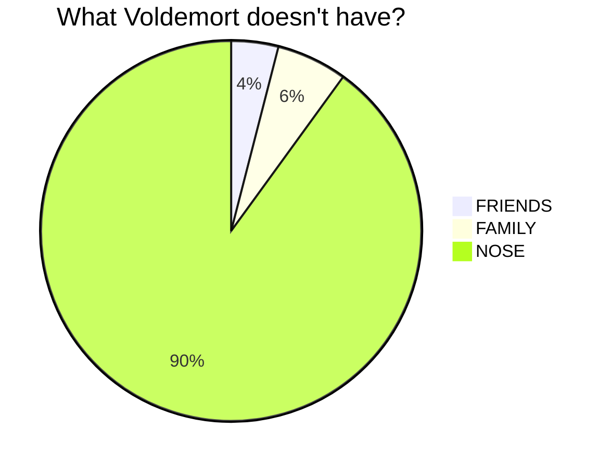

# Source Garden

Beautiful, zero configuration, project homepages.

<!-- sg:toc(global) -->
- [Overview](#overview)
- [Features](#features)
  - [Render markdown files from GitHub.](#render-markdown-files-from-github)
  - [Support extended markdown.](#support-extended-markdown)
    - [Tables](#tables)
    - [Highlighted code](#highlighted-code)
    - [Diagrams](#diagrams)
    - [Math](#math)
    - [(Planned) Task lists](#planned-task-lists)
    - [(Planned) Alert boxes](#planned-alert-boxes)
    - [(Planned) Emojis](#planned-emojis)
  - [(Planned) Inline layout configuration comments.](#planned-inline-layout-configuration-comments)
  - [(Planned) Shared header.](#planned-shared-header)
  - [(Planned) Shared footer.](#planned-shared-footer)
  - [(Planned) Shared sitemap.](#planned-shared-sitemap)
  - [(Planned) Reverse proxy caching.](#planned-reverse-proxy-caching)
  - [(Planned) Support non-main branches.](#planned-support-non-main-branches)
  - [(Planned) Support other git hosts.](#planned-support-other-git-hosts)
  - [(Planned) Support offline mode.](#planned-support-offline-mode)
  - [(Planned) Paid plans.](#planned-paid-plans)

## Overview

Source garden provides beautiful homepages and documentation for your project, rendered right from the markdown files in your repository. No configuration, compilation, or account required. Our goal is to remove one of the bars to open source project success.

Just navigate to `https://src.garden/<ghuser>/<ghrepo>` and see your homepage, or checkout the Source Garden homepage here: [https://src.garden/Shakeskeyboarde/SrcGarden](https://src.garden/Shakeskeyboarde/SrcGarden).

Here are some examples of home/documentation pages that will be possible in the future.

- [Docker Docs](https://docs.docker.com)
- [Heroku Dev Center](https://devcenter.heroku.com)
- [Plaid Docs](https://plaid.com/docs/)
- [Render Docs](https://render.com/docs)

<!-- sg:page -->
## Features

- [x] Render markdown files from GitHub.
- [ ] Support extended markdown.
  - [x] Tables.
  - [x] Highlighted code using [Highlight.js](https://highlightjs.org/) (all languages).
  - [x] Diagrams using [Mermaid](https://mermaid.js.org).
  - [x] Math (TeX) using [KaTeX](https://katex.org/).
  - [ ] Task lists.
  - [ ] Alert boxes.
  - [ ] Emoji tags (eg. `:smile:`) using [GitHub Emoji Images](https://api.github.com/emojis).
- [ ] Inline layout configuration comments.
  - [ ] Hero banner.
  - [ ] Breadcrumb.
  - [ ] Navigation sidebar.
  - [ ] Table of contents.
  - [ ] Virtual pages.
  - [ ] Card view.
  - [ ] Tab view.
  - [ ] Side-by-side view.
- [ ] Shared header.
- [ ] Shared footer.
- [ ] Shared sitemap.
- [ ] Reverse proxy caching.
- [ ] Support non-main branches.
- [ ] Support other git hosts (eg. GitLab, BitBucket).
- [ ] Support offline mode (PWA).
- [ ] Paid plans.
  - [ ] Custom domain names.
  - [ ] Custom theming.
  - [ ] Custom layouts.
  - [ ] Site search.
  - [ ] Private repository support.
  - [ ] Self hosting.

### Render markdown files from GitHub.

Files are rendered using the excellent [Marked](https://marked.js.org) package. All basic markdown features are supported, and parsing is "GitHub Compatible".

Navigate to `https://src.garden/<ghuser>/<ghrepo>/<path?>` to see the rendered version of a markdown file in your repository. If the path contains only a directory name without a dot (`.`) character, then `README.md` will be appended as the "index" page for the directory.

### Support extended markdown.

Source garden supports a number of extended markdown features, including tables, highlighted code, diagrams, and math. Additional support for alert boxes and emoji tags is planned.

<!-- sg:tab(v=true) -->
#### Tables

| Name | Age | Height |
| ---- | --- | ------ |
| Bob  | 25  | 6'0"   |
| Sue  | 30  | 5'5"   |

<!-- sg:tab(v=true) -->
#### Highlighted code

```ts
function hello(name: string) {
  console.log(`Hello, ${name}!`);
}
```

<!-- sg:tab(v=true) -->
#### Diagrams



<!-- sg:tab(v=true) -->
#### Math

Inline with `$` delimiters (no spaces): $e^{i\pi}+1=0$

Inline with `` $` `` and `` `$ `` delimiters (allows spaces): $`e^{i\pi} + 1 = 0`$

Blocks using `$$` delimiters:

$$e^{i\pi} + 1 = 0$$

Blocks using ` ```math ` code fences:

```math
e^{i\pi} + 1 = 0
```

<!-- sg:tab(v=true) -->
#### (Planned) Task lists

- [x] Complete.
- [ ] Incomplete.

<!-- sg:tab(v=true) -->
#### (Planned) Alert boxes

> **Note:**
> Noted.

> [!IMPORTANT]
> This is important.

> [!WARNING]
> Let this be a warning to you.

<!-- sg:tab(v=true) -->
#### (Planned) Emojis

:smile: :+1: :rocket:

### (Planned) Inline layout configuration comments.

What separates a good documentation site from a great one is the layout. Source garden will support a number of inline layout configuration comments which can be placed inline in your markdown files, to control the layout of the page. These comments will precede the markdown content that they affect, and will look something like this: `<!-- sg.card(params) -->`.

Layout possibilities are endless, but some planned examples include:

- Using part of the markdown file as a "hero" banner.
- Choosing parent directories to display as a "breadcrumb" navigation bar.
- Choosing a list of links to display as a "navigation" sidebar.
- Auto-generating a table of contents either inline or as a sidebar.
- Splitting a single markdown file into multiple "virtual" pages.
- Rendering a header section as part of a "card" view.
- Rendering a header section as part of a "tab" view.
- Rendering a header section or block as a grid element creating a "side-by-side" view.

### (Planned) Shared header.

A shared header will be a free feature which uses a single markdown file, probably named `HEADER.md`, from your repository root, and renders it on all pages as a header bar. It should contain a logo, title, and some links which provide "broad" navigation.

### (Planned) Shared footer.

A shared footer will be a free feature which uses a single markdown file, probably named `FOOTER.md`, from your repository root, and renders it on all pages as a footer section. It should contain a copyright notice, links to legal documents, and social links.

### (Planned) Shared sitemap.

A shared sitemap will be a free feature which uses a single markdown file, probably named `SITEMAP.md`, from your repository root, and renders it as the top part of the footer section. It should contain a comprehensive list of links to all pages in your site.

### (Planned) Reverse proxy caching.

Currently, repository files are fetched directly from your browser by calling the `raw.githubusercontent.com` API. There is a theoretical request limit on this API, though I have not been able to confirm it in practice. In the future, a reverse proxy will be used to cache these files, to reduce the upstream workload, and to improve reliability and performance.

### (Planned) Support non-main branches.

> [!NOTE]
> This may actually require that repositories be cloned by a backend service. Cloning isn't subject to rate limits, and nearly every other way to get source code from Github is.

### (Planned) Support other git hosts.

GitHub is definitely not the only place people host code. They should get nice web pages too. It may require a domain prefix to differentiate between hosts (eg. `https://bb.src.garden/...` for BitBucket).

### (Planned) Support offline mode.

Sure would be nice if your documentation were still available offline. At least after loading it once.

### (Planned) Paid plans.

Some planned features will require infrastructure or separate licensing and support. These features will be available to paying customers only.